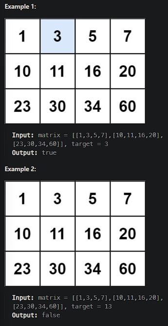

# [Search a 2D Matrix](https://leetcode.cn/problems/search-a-2d-matrix/)

You are given an `m x n` integer matrix `matrix` with the following two properties:

- Each row is sorted in non-decreasing order.
- The first integer of each row is greater than the last integer of the previous row.

Given an integer `target`, return `true` *if* `target` *is in* `matrix` *or* `false` *otherwise*.

You must write a solution in `O(log(m * n))` time complexity.



## Solution Approach

### Step

1. Calculate the total rows `m` and the total columns `n` of the `matrix`.
2. Utilize the concept of binary search, considering the `matrix` as a one-dimensional array with a length of `m*n`.
3. Map indices of the one-dimensional array to rows and columns in the `matrix`.
4. Compare `mid` with `target`: return `true` if they are equal; search the right part if `mid < target`, otherwise search the left part.
5. If `target` is not found when the traversal is over, return `false`.

```js
/**
 * @param {number[][]} matrix
 * @param {number} target
 * @return {boolean}
 */
var searchMatrix = function(matrix, target) {
    if (matrix.length === 0 || matrix[0].length === 0) return false;

    const m = matrix.length;
    const n = matrix[0].length;
    // `left` points to the beginning of the one-dimensional representation of `matrix`, which is `0`
    let left = 0;
    // `right` points to the end of the one-dimensional representation of `matrix`, which is `m * n - 1`
    let right = m * n - 1;

    while (left <= right) {
        // Calculate `mid` and map it to the specific row and column in `matrix`
        const mid = Math.floor((left + right) / 2);
        const midValue = matrix[Math.floor(mid / n)][mid % n];

        // Execute different actions based on the result of comparing `midValue` with `target`
        if (midValue === target) {
            return true;
        } else if (midValue < target) {
            left = mid + 1;
        } else {
            right = mid - 1;
        }
    }

    // If `target` is not found
    return false;
};

```

