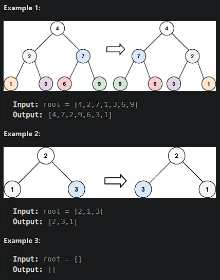

# [Invert Binary Tree](https://leetcode.cn/problems/invert-binary-tree/)

Given the `root` of a binary tree, invert the tree, and return *its root*.



## Solution Approach

Before considering how to invert a binary tree based on its root, let's think about the simplest case where the tree has 2 levels:

```js
var invertTree = function(root) {
    [root.left, root.right] = [root.right, root.left]
 	return root
};
```

For cases where the tree has more than two levels, we just need to recursively repeat the inversion process.

```js
/**
 * Definition for a binary tree node.
 * function TreeNode(val, left, right) {
 *     this.val = (val===undefined ? 0 : val)
 *     this.left = (left===undefined ? null : left)
 *     this.right = (right===undefined ? null : right)
 * }
 */
/**
 * @param {TreeNode} root
 * @return {TreeNode}
 */
var invertTree = function(root) {
    invertTreeInner(root)
    return root
};

/**
 * @param {TreeNode} root
 */
var invertTreeInner = function(root) {
    // Base case: if root is null, the current recursion has reached the branch end.
    if (root === null) {
        return;
    }
    // Invert left and right nodes.
    [root.left, root.right] = [root.right, root.left];
    // Recursively call invertTreeInner on the left node.
    invertTreeInner(root.left);
    // Recursively call invertTreeInner on the right node.
    invertTreeInner(root.right);
};
```

