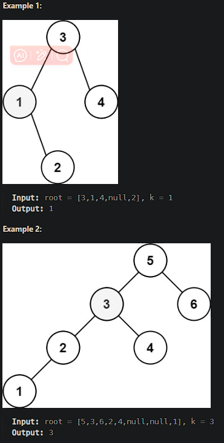

# [Kth Smallest Element in a BST](https://leetcode.cn/problems/kth-smallest-element-in-a-bst/)

Given the `root` of a binary search tree, and an integer `k`, return *the* `kth` *smallest value (**1-indexed**) of all the values of the nodes in the tree*.



## Solution Approach

To search for the kth smallest element in a binary search tree, you can leverage inorder traversal because it visits all nodes of a BST in ascending order.

### Steps

1. Use inorder traversal to traverse the entire tree.
2. Keep track of the node count. When the traversal reaches the kth node, the kth smallest element is found.

```js
/**
 * @param {TreeNode} root
 * @param {number} k
 * @return {number}
 */
var kthSmallest = function(root, k) {
    // Record the node count.
    let count = 0;
    // Record the kth smallest value.
    let result = null;
    
    // A recursive function to perform inorder traversal of a BST.
    const inorderTraversal = (node) => {
        // Return if `node` is empty or the kth smallest value is found.
        if (!node || result !== null) return;
        
        // First, recursively traverse the left subtree.
        inorderTraversal(node.left);
        
        // Handle the current node.
        // Increment `count`, and if `count` equals `k`, update `result` and return.
        count++;
        if (count === k) {
            result = node.val;
            return;
        }
        
        // Next, recursively traverse the right subtree.
        inorderTraversal(node.right);
    };
    
    inorderTraversal(root);
    return result;
};
```

