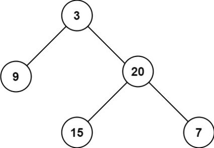

# [Maximum Depth of Binary Tree](https://leetcode.cn/problems/maximum-depth-of-binary-tree/)

Given the `root` of a binary tree, return *its maximum depth*.

A binary tree's **maximum depth** is the number of nodes along the longest path from the root node down to the farthest leaf node.

> **Example 1:**
>
> 
>
> ```
> Input: root = [3,9,20,null,null,15,7]
> Output: 3
> ```
>
> **Example 2:**
>
> ```
> Input: root = [1,null,2]
> Output: 2
> ```

## Solution Approach

First, we can consider `root` as the simplest case where it has no child nodes.

```js
const fun1 = function (root) {
    if(root === null){
        return 0
    }
    return 1
}
```

Next, we can consider a more complex case where `root` has only a left child node.

```js
const fun2 = function (root) {
    // Base case: if the root is null, return 0.
    if (root === null) {
        return 0;
    }
    // Recursively call fun2 with root.left and add 1.
    return fun2(root.left) + 1;
}
```

It is time to consider the full case for handling the maximum depth of a binary tree.


```js
/**
 * Definition for a binary tree node.
 * function TreeNode(val, left, right) {
 *     this.val = (val===undefined ? 0 : val)
 *     this.left = (left===undefined ? null : left)
 *     this.right = (right===undefined ? null : right)
 * }
 */
/**
 * @param {TreeNode} root
 * @return {number}
 */
const maxDepth = function (root) {
    if(root === null){
        return 0
    }
    // We can simultaneously apply recursion on root.left and root.right, then return the larger value plus 1.
    return Math.max(maxDepth(root.left), maxDepth(root.right))+1
}
```

