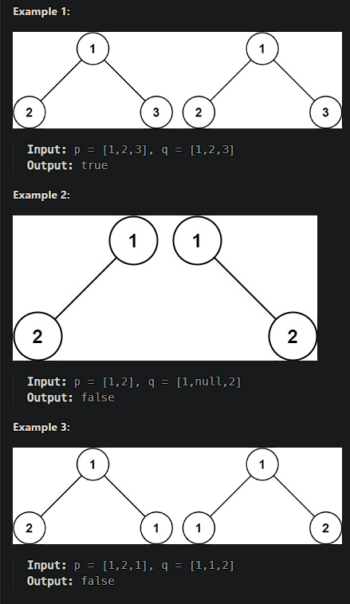

# [Same Tree](https://leetcode.cn/problems/same-tree/)

Given the roots of two binary trees `p` and `q`, write a function to check if they are the same or not.

Two binary trees are considered the same if they are structurally identical, and the nodes have the same value.

 

## Solution Approach

```js
/**
 * Definition for a binary tree node.
 * function TreeNode(val, left, right) {
 *     this.val = (val===undefined ? 0 : val)
 *     this.left = (left===undefined ? null : left)
 *     this.right = (right===undefined ? null : right)
 * }
 */
/**
 * @param {TreeNode} p
 * @param {TreeNode} q@param {TreeNode} q
 * @return {boolean}
 */
var isSameTree = function(p, q) {
    if((p===null&&q!==null) || (p!==null&&q===null)){
        // If either p or q is null while the other is not, return false.
        return false
    }
    if(p===null&&q===null){
        // If both of p and q are null, return true.
        return true
    }
    if(p.val !== q.val){
        // If p and q have different value, return false.
        return false
    }
    // Return the result of isSameTree(p.left, q.left) and isSameTree(p.right, q.right), so we can recursively perform the above three if statements.
    return isSameTree(p.left, q.left) && isSameTree(p.right, q.right)
};
```

