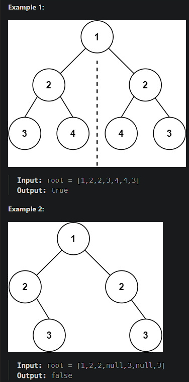

# [Symmetric Tree](https://leetcode.cn/problems/symmetric-tree/)

Given the `root` of a binary tree, *check whether it is a mirror of itself* (i.e., symmetric around its center).



## Solution Approach

```js
/**
 * Definition for a binary tree node.
 * function TreeNode(val, left, right) {
 *     this.val = (val===undefined ? 0 : val)
 *     this.left = (left===undefined ? null : left)
 *     this.right = (right===undefined ? null : right)
 * }
 */

//**
 * @param {TreeNode} root
 * @return {boolean}
 */
var isSymmetric = function(root) {
    // An empty tree is symmetric.
    if (root === null) {
        return true;
    }
    
    // Define an auxiliary function to check if the two trees are symmetric.
    var isMirror = function(tree1, tree2) {
        // Both trees are null, return true.
        if (tree1 === null && tree2 === null) {
            return true;
        }
        
        // One of the trees is null while the other is not, return false.
        if (tree1 === null || tree2 === null) {
            return false;
        }
        
        // If values of tree1 and tree2 are different, return false.
        if (tree1.val !== tree2.val) {
            return false;
        }
        
        // Recursively call isMirror to check their symmetry.
        return isMirror(tree1.left, tree2.right) && isMirror(tree1.right, tree2.left);
    };
    
    // Start the recursion.
    return isMirror(root.left, root.right);
};
```

