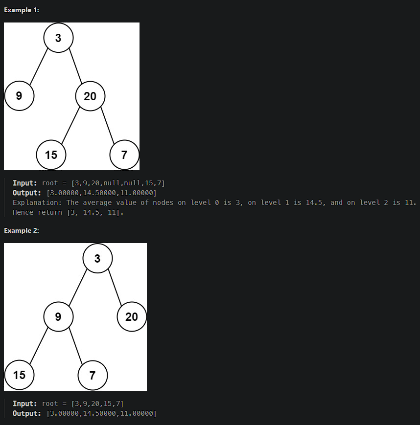

# [Average of Levels in Binary Tree](https://leetcode.cn/problems/average-of-levels-in-binary-tree/)

Given the `root` of a binary tree, return *the average value of the nodes on each level in the form of an array*. Answers within `10-5` of the actual answer will be accepted.



## Solution Approach

```js
/**
 * Definition fo a binary tree node.
 * function TreeNode(val, left, right) {
 *     this.val = (val===undefined ? 0 : val)
 *     this.left = (left===undefined ? null : left)
 *     this.right = (right===undefined ? null : right)
 * }
 */
TreeNode.prototype.level = 1

/**
 * @param {TreeNode} root
 * @return {number[]}
 */
var averageOfLevels = function(root) {
    // Create a map where keys represent the level and values represent arrays containing all nodes of the level.
    const map = new Map();
	
    next(root);

    function next(node){
        // Update `map`, if the current level already exists in `map`, add the node's value to the corresponding array, otherwise create a new array containing its value.
        map.set(node.level, 
                map.get(node.level) ?
                [...map.get(node.level), node.val] : [node.val]);
        
        // If the current node has a left node, update its level and continue the next recursion.
        if (node.left !== null) {
            node.left.level = node.level + 1;
            next(node.left);
        }
        
        // If the current node has a right node, update its level and continue the next recursion.
        if (node.right !== null) {
            node.right.level = node.level + 1;
            next(node.right);
        }
    }
    
    // When the entire recursion is over, return the result array based on map.values().
    return [...map.values()].map(arr => calculateAverage(arr));
};

function calculateAverage(arr) {
    const sum = arr.reduce((acc, val) => acc + val, 0);
    return sum / arr.length;
}
```

