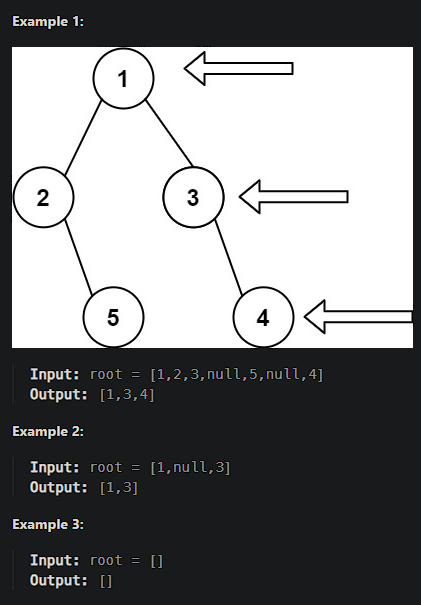

# [Binary Tree Right Side View](https://leetcode.cn/problems/binary-tree-right-side-view/)

Given the `root` of a binary tree, imagine yourself standing on the **right side** of it, return *the values of the nodes you can see ordered from top to bottom*.



## Solution Approach

```js
/**
 * Definition for a binary tree node.
 * function TreeNode(val, left, right) {
 *     this.val = (val===undefined ? 0 : val)
 *     this.left = (left===undefined ? null : left)
 *     this.right = (right===undefined ? null : right)
 * }
 */

// Add a property `level` to TreeNode.
TreeNode.prototype.level = 1;

var rightSideView = function(root) {
    // Preparation work
    if (root === null) return [];
    const map = new Map();

    function next(node, level) {
        // Update the corresponding value of the current level.
        map.set(level, node.val);
        
        // We continue calling `next` until the node is not a leaf node.
        // Because the calling order is left first then right, the last invocation of `map.set(level, node.val)` for each level will correspond to the rightmost node.
        if (node.left !== null) {
            next(node.left, level + 1);
        }
        if (node.right !== null) {
            next(node.right, level + 1);
        }
    }

    next(root, 1);
    
    // Return the array converted from map.values()
    return [...map.values()];
};
```

