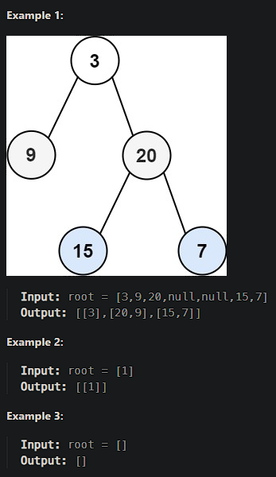

# [Binary Tree Zigzag Level Order Traversal](https://leetcode.cn/problems/binary-tree-zigzag-level-order-traversal/)

Given the `root` of a binary tree, return *the zigzag level order traversal of its nodes' values*. (i.e., from left to right, then right to left for the next level and alternate between).



## Solution Approach

```js
/**
 * Definition for a binary tree node.
 * function TreeNode(val, left, right) {
 *     this.val = (val===undefined ? 0 : val)
 *     this.left = (left===undefined ? null : left)
 *     this.right = (right===undefined ? null : right)
 * }
 */
TreeNode.prototype.level = 1

/**
 * @param {TreeNode} root
 * @return {number[][]}
 */
var zigzagLevelOrder = function(root) {
    if(root === null) return []
    const map = new Map()

    next(root)

    function next(node){
        map.set(node.level, map.get(node.level)?
                [...map.get(node.level), node.val]:[node.val])
        if(node.left !== null){
            node.left.level = node.level+1
            next(node.left)
        }
        if(node.right !== null){
            node.right.level = node.level+1
            next(node.right)
        }
    }
    return [...map.values()].map((arr, index)=>index%2===1?arr.reverse():arr)
};
```

