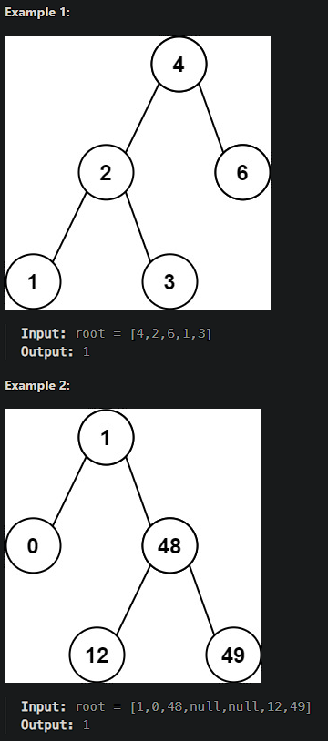

# [Minimum Absolute Difference in BST](https://leetcode.cn/problems/minimum-absolute-difference-in-bst/)

Given the `root` of a Binary Search Tree (BST), return *the minimum absolute difference between the values of any two different nodes in the tree*.



## Solution Approach

```js
/**
 * Definition for a binary tree node.
 * function TreeNode(val, left, right) {
 *     this.val = (val===undefined ? 0 : val)
 *     this.left = (left===undefined ? null : left)
 *     this.right = (right===undefined ? null : right)
 * }
 */
/**
 * @param {TreeNode} root
 * @return {number}
 */
var getMinimumDifference = function(root) {
    // Create a set to collect all node values of the binary tree based on `root`.
    const set = new Set();
    
    // The recursion to collect node values.
    function next(node) {
        set.add(node.val);
        if (node.left !== null) {
            next(node.left);
        }
        if (node.right !== null) {
            next(node.right);
        }
    }
    
    next(root);
    
    // Declare a `min` and assume it to Infinity.
    let min = Infinity;
    // Convert `set` to an array for sorting.
    const arr = [...set].sort((a, b) => a - b);
    
    // Update `min` in each comparison.
    for (let i = 1; i < arr.length; i++) {
        min = Math.min(min, arr[i] - arr[i - 1]);
    }
    
    // After sorting, return `min`
    return min;
};

```

