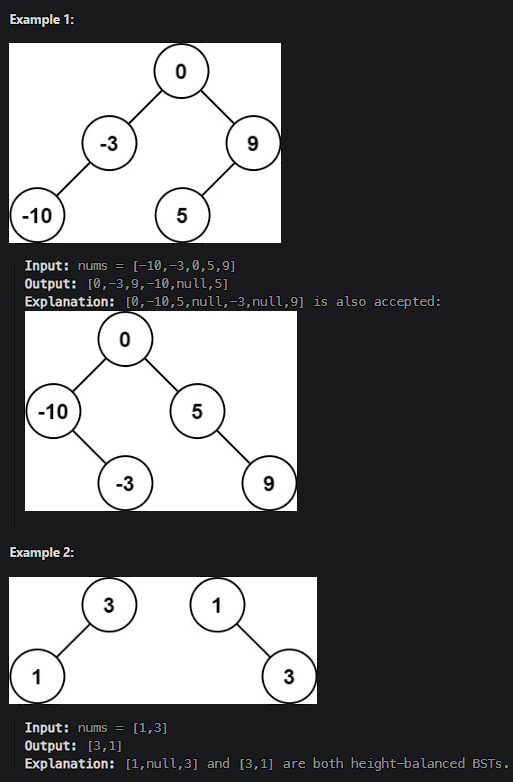

# [Convert Sorted Array to Binary Search Tree](https://leetcode.cn/problems/convert-sorted-array-to-binary-search-tree/)

Given an integer array `nums` where the elements are sorted in **ascending order**, convert *it to a* height-balanced binary search tree.



## Solution Approach

To convert an integer array `nums` sorted in ascending order into a height-balanced binary search tree (BST), we can use the recursive approach to continuously select the middle element as the root node and split the array into the left and right parts, which construct the left subtree and the right subtree, respectively.

```js
/**
 * Definition for a binary tree node.
 * function TreeNode(val, left, right) {
 *     this.val = (val===undefined ? 0 : val)
 *     this.left = (left===undefined ? null : left)
 *     this.right = (right===undefined ? null : right)
 * }
 */
/**
 * @param {number[]} nums
 * @return {TreeNode}
 */
var sortedArrayToBST = function(nums) {
    if (nums.length === 0) return null;

    // Helper function to construct BST
    const buildBST = (left, right) => {
        if (left > right) return null;
        
        // Choose middle element as root to ensure balance
        const mid = Math.floor((left + right) / 2);
        const node = new TreeNode(nums[mid]);

        // Recursively build the left and right subtrees
        node.left = buildBST(left, mid - 1);
        node.right = buildBST(mid + 1, right);

        return node;
    };

    return buildBST(0, nums.length - 1);
};

// 示例调用
console.log(sortedArrayToBST([-10, -3, 0, 5, 9])); // 输出：平衡二叉搜索树的根节点
console.log(sortedArrayToBST([1, 3])); // 输出：平衡二叉搜索树的根节点
```

1. **定义节点结构**：
   - 使用函数 `TreeNode` 定义树节点的结构，包括值 `val`、左子树 `left` 和右子树 `right`。
2. **递归构造树**：
   - 定义递归函数 `buildBST(left, right)`，用于构造从索引 `left` 到 `right` 的子树。
   - 如果 `left > right`，返回 `null` 表示当前子树为空。
   - 计算中间位置 `mid`，选择 `nums[mid]` 作为当前子树的根节点。
   - 递归构造左子树和右子树，并将结果赋值给当前节点的 `left` 和 `right` 属性。
3. **调用递归函数**：
   - 从整个数组的范围 `[0, nums.length - 1]` 开始调用递归函数 `buildBST`，返回构造好的二叉搜索树的根节点。

通过这种方法，可以高效地将一个升序数组转换为平衡二叉搜索树。