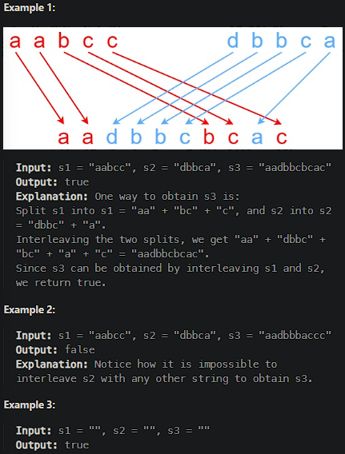

# [Interleaving String](https://leetcode.cn/problems/interleaving-string/)

Given strings `s1`, `s2`, and `s3`, find whether `s3` is formed by an **interleaving** of `s1` and `s2`.

An **interleaving** of two strings `s` and `t` is a configuration where `s` and `t` are divided into `n` and `m` substrings respectively, such that:

- `s = s1 + s2 + ... + sn`
- `t = t1 + t2 + ... + tm`
- `|n - m| <= 1`
- The **interleaving** is `s1 + t1 + s2 + t2 + s3 + t3 + ...` or `t1 + s1 + t2 + s2 + t3 + s3 + ...`

**Note:** `a + b` is the concatenation of strings `a` and `b`.



## Solution Approach

1. Create a two-dimensional DP array `dp` where `dp[i][j]` indicates  whether the first `i` characters of `s1` and the first `j` characters of  `s2` can be interleaved to form the first `i+j` characters of `s3`.
2. Initialize the DP array:
   * `dp[0][0]` is `true`, indicating empty strings can be interleaved to form an empty string.
   * The initialization of the first column and the first column:
     * `dp[i][0]` indicates whether using only the first `i` characters of `s1` can interleave to form the first `i` characters of `s3`.
     * `dp[i][0]` indicates whether using only the first `j` characters of `s2` can interleave to form the first `j` characters of `s3`.
3. Fill the DP array:
   * For each position `dp[i][j]`, if `s1[i-1]` equals `s3[i+j-1]` and `dp[i-1][j]` is true, `dp[i][j]` is true.
   * If `s2[j-1]` equals `s3[i+j-1]` and `dp[i][j-1]` is true, `dp[i][j]` is true.

```js
/**
 * @param {string} s1
 * @param {string} s2
 * @param {string} s3
 * @return {boolean}
 */
var isInterleave = function(s1, s2, s3) {
    if (s1.length + s2.length !== s3.length) return false;

    let m = s1.length;
    let n = s2.length;

    let dp = Array.from({ length: m + 1 }, () => Array(n + 1).fill(false));

    dp[0][0] = true;

    for (let i = 1; i <= m; i++) {
        dp[i][0] = dp[i-1][0] && s1[i-1] === s3[i-1];
    }

    for (let j = 1; j <= n; j++) {
        dp[0][j] = dp[0][j-1] && s2[j-1] === s3[j-1];
    }

    for (let i = 1; i <= m; i++) {
        for (let j = 1; j <= n; j++) {
            dp[i][j] = (dp[i-1][j] && s1[i-1] === s3[i+j-1]) || (dp[i][j-1] && s2[j-1] === s3[i+j-1]);
        }
    }

    return dp[m][n];
};
```

