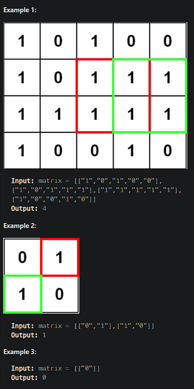

# [Maximal Square](https://leetcode.cn/problems/maximal-square/)

Given an `m x n` binary `matrix` filled with `0`'s and `1`'s, *find the largest square containing only* `1`'s *and return its area*.



## Solution Approach

o solve the problem of finding the maximal square containing only `1`s in a two-dimensional matrix consisting of `0`s and `1`s, we can use Dynamic Programming.

### The idea of DP

1. Define state:
   * We define a two-dimensional array `dp`, where `dp[i][j]` indicates the edge length of the maximal square that treats `dp[i][j]` as its bottom-right corner.
2. State translation formula
   * If `matrix[i][j] == '1'`， `dp[i][j] = min(dp[i-1][j], dp[i][j-1], dp[i-1][j-1]) + 1`.
   * If `matrix[i][j] == '0'`， `dp[i][j] = 0`.
3. Initialization
   * Initialize the first row and the first column of array `dp`, if `matrix[i][j] == '1'`,  `dp[i][j] = 1`.
4. Calculate the edge length pf the maximal square
   * Maintain a variable `maxSide` to record the edge length of the maximal square.
   * Traverse array `dp`, update `maxSide`.
5. Return result
   * The area of the maximal square is `maxSide * maxSide`.

```js
/**
 * @param {character[][]} matrix
 * @return {number}
 */
var maximalSquare = function(matrix) {
    if (matrix.length === 0 || matrix[0].length === 0) return 0;

    const rows = matrix.length;
    const cols = matrix[0].length;
    const dp = Array.from({ length: rows }, () => Array(cols).fill(0));
    let maxSide = 0;

    for (let i = 0; i < rows; i++) {
        for (let j = 0; j < cols; j++) {
            if (matrix[i][j] === '1') {
                if (i === 0 || j === 0) {
                    dp[i][j] = 1;
                } else {
                    dp[i][j] = Math.min(dp[i-1][j], dp[i][j-1], dp[i-1][j-1]) + 1;
                }
                maxSide = Math.max(maxSide, dp[i][j]);
            }
        }
    }

    return maxSide * maxSide;
};

// 示例调用
console.log(maximalSquare([
    ["1","0","1","0","0"],
    ["1","0","1","1","1"],
    ["1","1","1","1","1"],
    ["1","0","0","1","0"]
])); // 输出：4

console.log(maximalSquare([
    ["0","1"],
    ["1","0"]
])); // 输出：1

console.log(maximalSquare([
    ["0"]
])); // 输出：0
```

