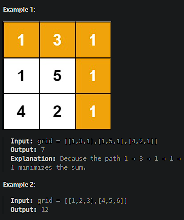

# [Minimum Path Sum](https://leetcode.cn/problems/minimum-path-sum/)

Given a `m x n` `grid` filled with non-negative numbers, find a path from top left to bottom right, which minimizes the sum of all numbers along its path.

**Note:** You can only move either down or right at any point in time.



## Solution Approach

We'll create a two-dimensional `dp` where `dp[i][j]` indicates the minimum path sum from the starting point `(0, 0)` to `(i, j)`.

### Steps

1. Initialize an array `dp` with the size of `grid`, where the initial value of `dp[0][0]` is `grid[0][0]`.
2. Fill the first row and first column since you can move only rightward or downward from the starting point to these positions.
3. For other positions `(i, j)`, `dp[i][j]` can be reached from the left side `(i, j-1)` or the top side `(i-1, j)`, so: `dp[i][j] = min(dp[i-1][j], dp[i][j-1]) + grid[i][j]`.
4. Finally return `dp[m-1][n-1]` which contains the minimum path sum from the starting point to the end point.

```js
/**
 * @param {number[][]} grid
 * @return {number}
 */
var minPathSum = function(grid) {
    let m = grid.length;
    let n = grid[0].length;
    
    // 创建 dp 数组并初始化
    let dp = Array.from({ length: m }, () => Array(n).fill(0));
    dp[0][0] = grid[0][0];
    
    // 初始化第一行
    for (let j = 1; j < n; j++) {
        dp[0][j] = dp[0][j - 1] + grid[0][j];
    }
    
    // 初始化第一列
    for (let i = 1; i < m; i++) {
        dp[i][0] = dp[i - 1][0] + grid[i][0];
    }
    
    // 填充 dp 数组
    for (let i = 1; i < m; i++) {
        for (let j = 1; j < n; j++) {
            dp[i][j] = Math.min(dp[i - 1][j], dp[i][j - 1]) + grid[i][j];
        }
    }
    
    return dp[m - 1][n - 1];
};

// 示例调用
console.log(minPathSum([[1,3,1],[1,5,1],[4,2,1]])); // 输出：7
console.log(minPathSum([[1,2,3],[4,5,6]]));         // 输出：12
```

**初始化 dp 数组**：

- `dp[0][0]` 被初始化为 `grid[0][0]` 的值。

**填充第一行和第一列**：

- 第一行的每个元素只能从左边的元素到达。
- 第一列的每个元素只能从上面的元素到达。

**填充其他位置**：

- 对于每个位置 `(i, j)`，可以从左边 `(i, j-1)` 或上边 `(i-1, j)` 到达，取这两个值的最小值加上当前格子的值 `grid[i][j]`。

**返回结果**：

- 最终的结果存储在 `dp[m-1][n-1]` 中，即从起点到终点的最小路径和。