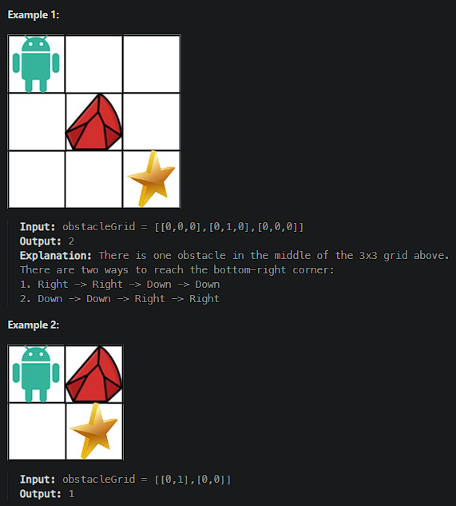

# [Unique Paths II](https://leetcode.cn/problems/unique-paths-ii/)

You are given an `m x n` integer array `grid`. There is a robot initially located at the **top-left corner** (i.e., `grid[0][0]`). The robot tries to move to the **bottom-right corner** (i.e., `grid[m - 1][n - 1]`). The robot can only move either down or right at any point in time.

An obstacle and space are marked as `1` or `0` respectively in `grid`. A path that the robot takes cannot include **any** square that is an obstacle.

Return *the number of possible unique paths that the robot can take to reach the bottom-right corner*.

The testcases are generated so that the answer will be less than or equal to `2 * 109`.



## Solution Approach

```js
/**
 * @param {number[][]} obstacleGrid
 * @return {number}
 */
var uniquePathsWithObstacles = function(obstacleGrid) {
    let m = obstacleGrid.length;
    let n = obstacleGrid[0].length;
    
    //If either the starting point or the ending point has an obstacle, directly return 0 because the ending point is unreachable.
    if (obstacleGrid[0][0] === 1 || obstacleGrid[m - 1][n - 1] === 1) {
        return 0;
    }
    
    // Initialize dp array.
    let dp = Array.from({ length: m }, () => Array(n).fill(0));
    // Initialize dp[0][0] to 1 because there is only one path from the starting point to the starting point, which is immobility.
    dp[0][0] = 1;
    
    // Initialize the first column.
    for (let i = 1; i < m; i++) {
        // If the current point has no obstacle, the path count inherits from the point above; otherwise, it is 0.
        dp[i][0] = obstacleGrid[i][0] === 1 ? 0 : dp[i - 1][0];
    }
    
    // Initialize the first row.
    for (let j = 1; j < n; j++) {
        // If the current point has no obstacle, the path count inherits from the point left; otherwise, it is 0.
        dp[0][j] = obstacleGrid[0][j] === 1 ? 0 : dp[0][j - 1];
    }
    
    // fill dp array
    // For each non-starting point, if the current point has no obstacle, the path count is the sum of the path counts of the points above it and to the left of it. If any obstacle exists, the path count is 0.
    for (let i = 1; i < m; i++) {
        for (let j = 1; j < n; j++) {
            if (obstacleGrid[i][j] === 1) {
                dp[i][j] = 0;
            } else {
                dp[i][j] = dp[i - 1][j] + dp[i][j - 1];
            }
        }
    }
    // The path count from the start to the end.
    return dp[m - 1][n - 1];
};

// 示例调用
console.log(uniquePathsWithObstacles([[0,0,0],[0,1,0],[0,0,0]])); // 输出：2
console.log(uniquePathsWithObstacles([[0,1],[0,0]]));             // 输出：1
```

