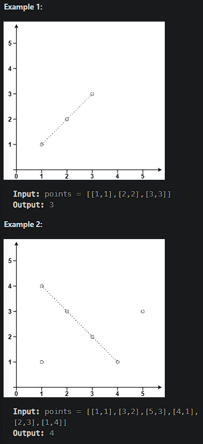

# [Max Points on a Line](https://leetcode.cn/problems/max-points-on-a-line/)

Given an array of `points` where `points[i] = [xi, yi]` represents a point on the **X-Y** plane, return *the maximum number of points that lie on the same straight line*.

