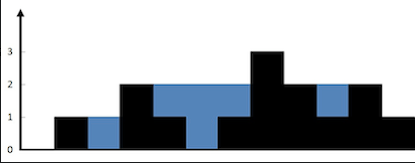

# [Trapping Rain Water](https://leetcode.cn/problems/trapping-rain-water/)

Given `n` non-negative integers representing an elevation map where the width of each bar is `1`, compute how much water it can trap after raining.

**Example 1:**



```
Input: height = [0,1,0,2,1,0,1,3,2,1,2,1]
Output: 6
Explanation: The above elevation map (black section) is represented by array [0,1,0,2,1,0,1,3,2,1,2,1]. In this case, 6 units of rain water (blue section) are being trapped.
```

**Example 2:**

```
Input: height = [4,2,0,3,2,5]
Output: 9
```

## Solution Approach

To solve the problem, we can use dynamic programming to calculate the amount of rainwater that can be stored by each column. Specifically, we need to respectively calculate the maximum heights on the left and right sides of each column, then calculating the rainwater amount that can be stored by each column.

### Steps

1. Create two arrays  `leftMax` and `rightMax`.
   * `leftMax[i]` indicates the maximum height from column `0` to column `i`.
   * `rightMax[i]` indicates the maximum height from column `i` to column `n-1`.
2. Traverse the array `height` to populate the `leftMax` and `rightMax` arrays.
3. Traverse the array `height` to calculate the rainwater can be stored by each column.
4. Accumulate the rainwater stored by all columns to get the total amount.

### Implementation Code

```js
/**
 * @param {number[]} height
 * @return {number}
 */
var trap = function(height) {
    if (height.length === 0) return 0;
	
    // Initialization
    const n = height.length;
    const leftMax = new Array(n).fill(0);
    const rightMax = new Array(n).fill(0);
    let water = 0;

    // Fill leftMax array
    leftMax[0] = height[0];
    for (let i = 1; i < n; i++) {
        leftMax[i] = Math.max(leftMax[i - 1], height[i]);
    }

    // Fill rightMax array
    rightMax[n - 1] = height[n - 1];
    for (let i = n - 2; i >= 0; i--) {
        rightMax[i] = Math.max(rightMax[i + 1], height[i]);
    }

    // Calculate the trapped water
    for (let i = 0; i < n; i++) {
        water += Math.min(leftMax[i], rightMax[i]) - height[i];
    }

    return water;
};

// 示例调用
console.log(trap([0,1,0,2,1,0,1,3,2,1,2,1])); // 输出：6
console.log(trap([4,2,0,3,2,5])); // 输出：9
```

