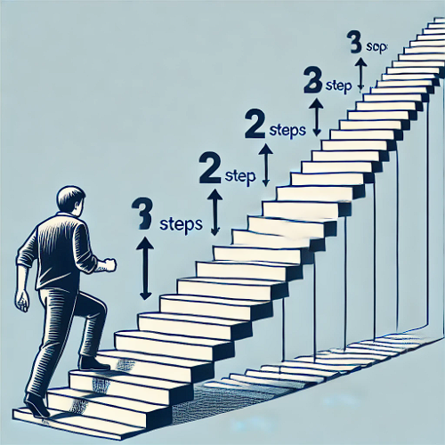

# [Climbing Stairs](https://leetcode.cn/problems/climbing-stairs/)



You are climbing a staircase. It takes `n` steps to reach the top.

Each time you can either climb `1` or `2` steps. In how many distinct ways can you climb to the top?

 

**Example 1:**

```
Input: n = 2
Output: 2
Explanation: There are two ways to climb to the top.
1. 1 step + 1 step
2. 2 steps
```

**Example 2:**

```
Input: n = 3
Output: 3
Explanation: There are three ways to climb to the top.
1. 1 step + 1 step + 1 step
2. 1 step + 2 steps
3. 2 steps + 1 step
```

```js
/**
 * @param {number} n
 * @return {number}
 */
var climbStairs = function(n) {
}
```

## Solution Approach

To solve the problem of climbing a staircase where each time you can either climb 1 or 2 steps, you can use dynamic programming. This problem is similar to the Fibonacci sequence, where each step can be reached from the previous step or the step before the previous step.

### 1. Base Cases

* If `n` is 1, there is only 1 way to climb the stairs (1 step).
* If `n` is 2, there are 2 ways to climb the stairs (1+1 steps or 2 steps).

### 2. Recursive Relation:

* For any step `i`, the number of ways to reach `i` is the sum of the ways to reach `i-1` and `i-2`.
* This is because you can get to step `i` by either taking a single step from `i-1` or a double step from `i-2`.

You can use an array to store the number of ways to reach each step and then iteratively calculate the number of ways to reach the top.

```js
var climbStairs = function(n){
    if(n<=1) return 1
    
    let dp = new Array(n+1).fill(0)
    // there is 1 way to reach the first step
    dp[1] = 1
    // there are 2 ways to reach the second step
    dp[2] = 2
    
    for(let i=3; i <= n; i++){
        // 3 = 2 + 1 // 1+1+1,1+2,2+1
        // 4 = 3 + 1
        // ...
        // n = (n-1) + (n-2)
        dp[i] = dp[i-1]+dp[i-2]
    }
    
    // The value at `dp[n]` will give the number of ways to reach the top of the staircase
    return dp[n]
}
```

This approach has a time complexity of O(n) and a space complexity of 0(n) due to the array used to store the results. However, you can optimize the space complexity to O(1) by using two variables to store the previous two results instead of an array.

```js
/**
 * @param {number} n
 * @return {number}
 */
var climbStairs = function(n) {
    if(n<=1) return 1
    let a= 1, b=2
    
    for(let i = 3； i<=n； i++){
        let temp = a+b
        a = b
        b = temp
    }
    
    return b
}
```

In this optimized version, `a` and `b` are used to store the number of ways to reach the last two steps, and the loop updates these values iteratively until the desired step is reached.