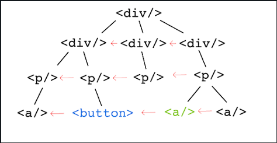

# 158. Previous Left Sibling

Given a DOM tree and a target element, please return the **previous left sibling**.



Like above, the previous left sibling of green `<a/>` is the blue `<button/>`. Notice that **they don't necessarily have the same parent element.**

If no left sibling, then return `null`.

What is time & space cost of your solution ?

## Solution

```js
/**
 * @param {Element} root
 * @param {Element} target
 * @return {Elemnt | null}
 */
function previousLeftSibling(root, target) {
  const q = [root];
  while (q.length) {
    const n = q.length;
    let prev = null;
    for (let i=0; i<n; i++) {
      const curr = q.shift();
      if (curr === target) {
        return prev;
      }
      q.push(...curr.children);
      prev = curr;
    }
  }
  return null;
}
```

