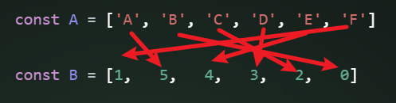

# Reorder array with new indexes

Suppose we have an array of items - `A`, and another array of indexes in numbers - `B`.

```js
const A = ['A', 'B', 'C', 'D', 'E', 'F']
const B = [1,   5,   4,   3,   2,   0]
```

You need to reorder A, so that the A[i] is put at index of B[i], which means B is the new index for each item of A.

For above example A should be modified inline to following

```js
['F', 'A', 'E', 'D', 'C', 'B']
```

The input are always valid.

*follow-up*

It is fairly easy to do this by using extra `O(n)` space, could you solve it with `O(1)` space?



>#### Thinking🤔
>
>```js
>1. Iterate over B.
>2. Check B[i] === i
>3. If so, we continue the next iteration.
>4. If no, we swap B[i] with B[B[i]], then swap A[i] with A[B[i]].
>```

## Solution Approach

To reorder array `A` such that `A[i]` is placed at the index specified by `B[i]`, we need to modify `A` in place according to the indexes provided in `B`. Achieving this in `O(1)` extra space can be done by cyclically swapping elements into their correct positions.

Here is a solution approach for the problem:

1. **Cyclic Swapping**:
   - Instead of creating a new array or using additional space, we can place each element directly into its correct position in a series of swaps.
   - This is done by iterating through the array and swapping elements until each element is in its correct position as per `B`.

2. **Implementation Details**:
   - Iterate over the array `A`.
   - For each index `i`, place `A[i]` in its new position `B[i]`.
   - To handle cycles (when an element points back to a previously visited position), keep swapping elements until the current element is at its correct position.

Here's the implementation:

```javascript
/**
 * @param {any[]} items
 * @param {number[]} newOrder
 * @return {void}
 */
function sort(items, newOrder) {
  const n = items.length;
  
  for (let i = 0; i < n; i++) {
    // While the current item is not in the correct position
    // 1 !== 0
    if (newOrder[i] !== i) {
      const targetIndex = newOrder[i];
      
      // Swap items
      [items[i], items[targetIndex]] = [items[targetIndex], items[i]];// 💡This semicolon can't be omitted.
      
      // Swap newOrder indices
      [newOrder[i], newOrder[targetIndex]] = [newOrder[targetIndex], newOrder[i]];
    }
  }
}

const A = ['A', 'B', 'C', 'D', 'E', 'F'];
const B = [1, 5, 4, 3, 2, 0];
sort(A, B);
console.log(A); // Output: ['F', 'A', 'E', 'D', 'C', 'B']
```

### Explanation:

1. **Cyclic Swapping**:
   - We use a while loop to place each element in its correct position. 
   - If `newOrder[i]` is not `i`, it means the element at index `i` should be swapped with the element at index `newOrder[i]`.

2. **In-place Swapping**:
   - We swap both the items in `items` and their corresponding indices in `newOrder` to ensure that the elements and their target positions are correctly updated.
   - This continues until each element is at its correct position.

### Follow-up for O(1) Space:

- This approach uses `O(1)` extra space since it only uses temporary variables for swapping and does not allocate any additional arrays or data structures.
- The time complexity is `O(n)`, as each element is placed in its correct position through a series of swaps, and each element is moved at most once.

This ensures that the input array `A` is reordered as per the indices specified in `B` with minimal additional space usage.