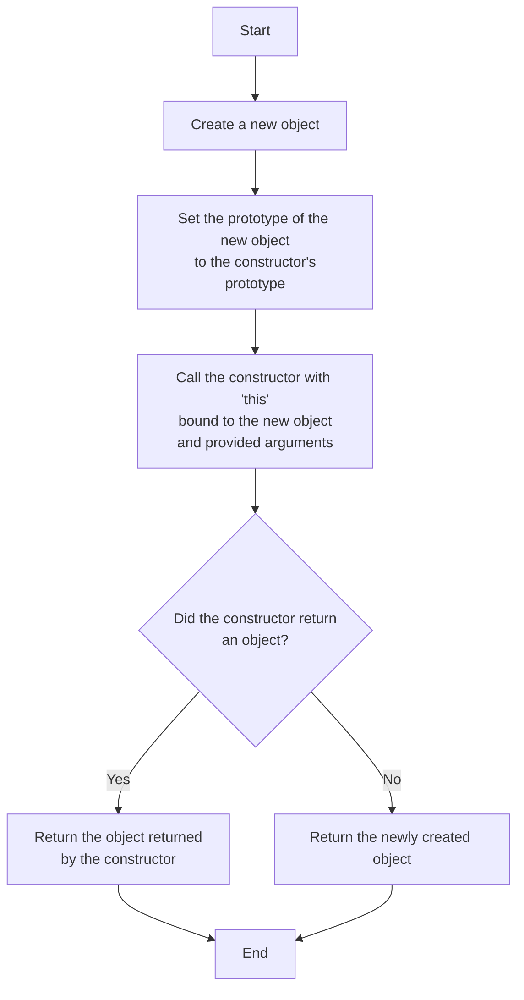

# 60. create your own `new` operator

[`new` operator](https://developer.mozilla.org/en-US/docs/Web/JavaScript/Reference/Operators/new) is used to create new instance objects.

Do you know exactly what `new` does?

You are asked to implement `myNew()`, which should return an object just as what `new` does but without using `new`.

Pay attention to the return type of constructor.

## Solution




```js
/**
 * @param {Function} constructor
 * @param {any[]} args - argument passed to the constructor
 * `myNew(constructor, ...args)` should return the same as `new constructor(...args)`
 */
const myNew = (constructor, ...args) => {
  // 1. Create an empty object
  const obj = {};

  // 2. Set the prototype of the new object to the constructor's prototype
  Object.setPrototypeOf(obj, constructor.prototype);

  // 3. Call the constructor with 'this' bound to the new object
  const result = constructor.apply(obj, args);

  // 4. Return the new object unless the constructor explicitly returns an object
  return result && typeof result === 'object' ? result : obj;
};

```

