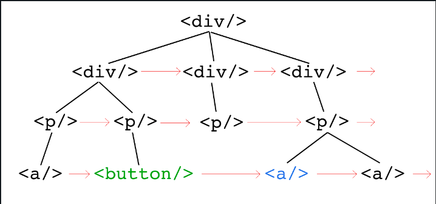

# 89. Next Right Sibling

Given a DOM tree and a target element, please return the **next right sibling**.



Like above, the next right sibling of `<button/>` is the blue `<a/>`. Notice that **they don't necessarily have the same parent element.**

If no right sibling, then return `null`.

What is time & space cost of your solution ?

## Solution

```js
/**
 * @param {HTMLElement} root
 * @param {HTMLElement} target
 * @return {HTMLElement | null}
 */
function nextRightSibling(root, target) {
  if (!root || !target) return null;

  // Queue for breadth-first traversal
  let queue = [root];

  while (queue.length > 0) {
    // Get the front element of the queue
      let currentNode = queue.shift();

      // Check if the currentNode is the target
      if (currentNode === target) {
        // The next element in the queue will be the next right sibling
        return queue.length > 0 ? queue[0] : null;
      }

      // Add children of the current node to the queue
      for (let child of currentNode.children) {
        queue.push(child);
      }
  }

  // If we finish the loop without finding the target, return null
  return null;
}
```

