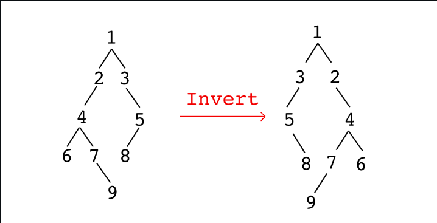

# 91. invert a binary tree

Inverting a node means swapping its left child and right child. You need to apply this to all nodes. As following figure illustrates.



## Solution

```js
// Assuming Node is defined as follows:
// function Node(value, left = null, right = null) {
//   this.value = value;
//   this.left = left;
//   this.right = right;
// }

/**
 * @param {Node} node
 * @returns {Node}
 */
function invert(node) {
  if (node === null) {
    return null;
  }

  // Swap the left and right children
  [node.left, node.right] = [node.right, node.left];

  // Recursively invert the left and right subtrees
  invert(node.left);
  invert(node.right);

  return node;
}
```

