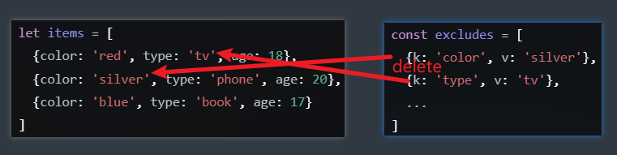
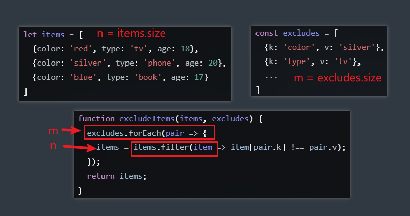
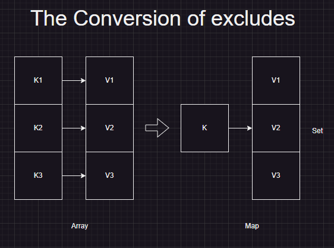

#  Improve a function

<audio src="assets/Improve%20a%20function.mp3"></audio>

Given an input of an array, which is made of items with at least three properties, for example:

```js
// Given an input of array, 
// which is made of items with >= 3 properties
let items = [
  {color: 'red', type: 'tv', age: 18}, 
  {color: 'silver', type: 'phone', age: 20},
  {color: 'blue', type: 'book', age: 17}
] 
// an exclude array made of key value pair
const excludes = [ 
  {k: 'color', v: 'silver'}, 
  {k: 'type', v: 'tv'}, 
  ...
] 
function excludeItems(items, excludes) { 
  excludes.forEach( pair => { 
    items = items.filter(item => item[pair.k] === item[pair.v])
  })
 
  return items
} 
```

1. What does this function `excludeItems` do?

   > The function excludeItems is designed to filter out items from the input array items based on the exclusion criteria provided in the excludes array. Each exclusion criterion in excludes is a key-value pair, where key is the property to check, and value is the value to exclude.

2. Is this function working as expected ?

   > No, the provided function includes items that match the exclusion criteria instead of excluding them.

3. What is the time complexity of this function?

   > The time complexity is O(n * m), where n is the number of items and m is the number of exclusion criteria.

4. How would you optimize it ?

   > To optimize, we can use a Set for exclusions and combine all exclusions into a single filter pass.

*note*

we only judge by the result, not the time cost. please submit the best approach you can.

## Solution Approach

The function `excludeItems` is designed to filter out items from the input array `items` based on the exclusion criteria provided in the `excludes` array. Each exclusion criterion in `excludes` is a key-value pair, where `k` is the property to check, and `v` is the value to exclude.

### Function Explanation

1. **Input:**
   - `items`: An array of objects, where each object has at least three properties.
   
     ```js
     let items = [
       {color: 'red', type: 'tv', age: 18}, 
       {color: 'silver', type: 'phone', age: 20},
       {color: 'blue', type: 'book', age: 17}
     ] 
     ```
   
   - `excludes`: An array of objects, each with properties `k` (key) and `v` (value) that specify the exclusion criteria.
   
     ```js
     const excludes = [ 
       {k: 'color', v: 'silver'}, 
       {k: 'type', v: 'tv'}, 
       ...
     ] 
     ```
   
2. **Process:**
   
   - For each exclusion criterion in `excludes`, filter out the items that match the criterion.
   
     
   
3. **Output:**
   - The function returns an array of items that do not match any of the exclusion criteria.

### Issues in the Provided Function

1. **Logic Error:**
   
   - The provided function includes items that match the exclusion criteria instead of excluding them. This is evident from the line:
     ```javascript
     items = items.filter(item => item[pair.k] === item[pair.v])
     ```
   - This line should exclude items that match the criterion, but **it actually includes them.**
   
2. **Expected Function:**
   - The correct function should filter out items that match the exclusion criteria.

### Corrected Function

Here is the corrected function:

```javascript
/**
 * @param {object[]} items
 * @param { Array< {k: string, v: any} >} excludes
 * @return {object[]}
 */
function excludeItems(items, excludes) { 
  excludes.forEach(pair => { 
    items = items.filter(item => item[pair.k] !== pair.v);
  });
  return items;
} 
```

### Time Complexity

- **Time Complexity:** The time complexity is O(n * m), where `n` is the number of items and `m` is the number of exclusion criteria. This is because for each exclusion criterion, the function iterates through all items to filter them.



### Optimization

1. **Using a Set for Exclusions:**
   - Convert the `excludes` array into a more efficient data structure, such as a `Set`, to reduce the complexity of checking whether an item should be excluded.

2. **Combining Exclusions:**
   - Instead of applying each exclusion one by one, combine them into a single filter pass.

Here is an optimized version:

```javascript
/**
 * @param {object[]} items
 * @param { Array< {k: string, v: any} >} excludes
 * @return {object[]}
 */
function excludeItems(items, excludes) {
  // k: the property to check
  // v: a set of values to exclude for that property
  const excludeMap = new Map();

  excludes.forEach(pair => {
    if (!excludeMap.has(pair.k)) {
      excludeMap.set(pair.k, new Set());
    }
    excludeMap.get(pair.k).add(pair.v);
  });

  return items.filter(item => {
    for (const [key, values] of excludeMap.entries()) {
      if (values.has(item[key])) {
        return false;
      }
    }
    return true;
  });
}
```



### Explanation of Optimized Function

1. **Exclusion Map:**
   - Create a map where the key is the property to check and the value is a set of values to exclude for that property.

2. **Single Pass Filter:**
   - Use a single `filter` pass to check if any item's property matches the exclusion criteria in the map. If it does, exclude that item.

This optimized version improves efficiency by reducing the number of times the items array is iterated over, combining all exclusions into a single filter operation.