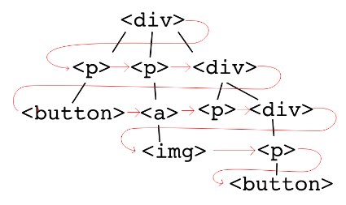
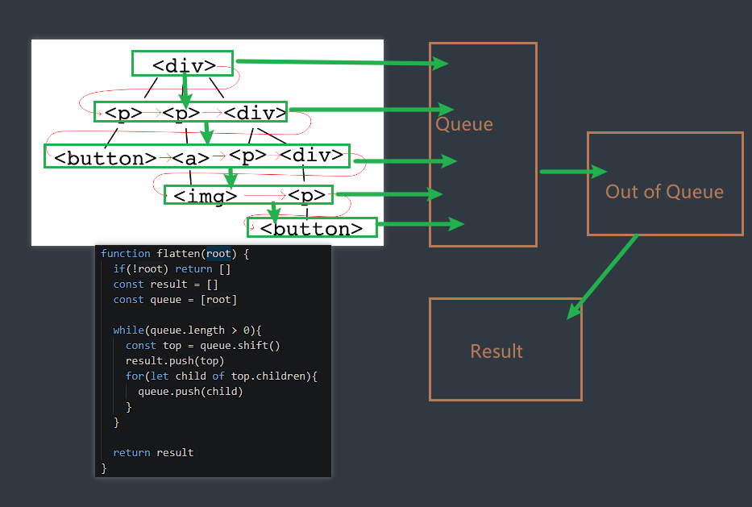

# Traverse DOM level by level

<audio src="assets/Traverse%20DOM%20level%20by%20level.mp3"></audio>

Given a DOM tree, flatten it into an one dimensional array, in the order of layer by layer, like below.



## Solution Approach

To flatten a DOM tree into a one-dimensional array in the order of layer by layer, also known as breadth-first traversal, you can use a queue to traverse the tree level by level.



```js
/**
 * @param {HTMLElement | null} root
 * @return {HTMLElement[]}
 */
function flatten(root) {
    if(!root) return []
    // start by initializing an empty array `result` to store the flattened elements.
    const result = []
    // use a queue (initialized with the root element) to keep track of nodes to be processed.
    const queue = [root]
    
    // while the queue is not empty
    while(queue.length > 0){
        // remove the first element (FIFO order) from the queue
        const current = queue.shift()
        // push it to the `result` array
        result.push(current)
        
        // for each child of the current node, push the child onto the queue.
        for(let child of current.children){
            queue.push(child)
        }
    }
    
    // after the queue is empty, return the `result` array which contains all elements in a breadth-first order.
    return result
}
```

