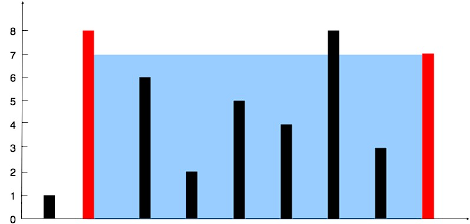

# [Container With Most Water](https://leetcode.cn/problems/container-with-most-water/)

You are given an integer array `height` of length `n`. There are `n` vertical lines drawn such that the two endpoints of the `ith` line are `(i, 0)` and `(i, height[i])`.

Find two lines that together with the x-axis form a container, such that the container contains the most water.

Return *the maximum amount of water a container can store*.

**Notice** that you may not slant the container.

**Example 1:**



```
Input: height = [1,8,6,2,5,4,8,3,7]
Output: 49
Explanation: The above vertical lines are represented by array [1,8,6,2,5,4,8,3,7]. In this case, the max area of water (blue section) the container can contain is 49.
```

**Example 2:**

```
Input: height = [1,1]
Output: 1
```

## Full Code

```js
/**
 * @param {number[]} height
 * @return {number}
 */
var maxArea = function(height) {
    // the left pointer
    let left = 0;
    // the right pointer
    let right = height.length - 1;
    // the max area
    let max = 0;
	
    //If left is less than right, continue the while loop.
    while (left < right) {
        // calculate `width`
        let width = right - left;
        // Calculate h based on the lower height line.
        let h = Math.min(height[left], height[right]);
        // Calculate `area` by `width` multiplied by `h`.
        let area = width * h;
        // Calculate the area by multiplying the width by h
        max = Math.max(max, area);

        // Move the pointer of the line with the shorter height.
        if (height[left] < height[right]) {
            // Auto-increment `left`
            left++;
        } else {
            // Auto-decrement `right`
            right--;
        }
    }

    return max;
};
```

